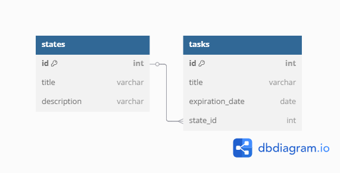

# ApiTaskManager

  API RESTful para gestionar tareas.

## End Points:

  1. POST /tasks -> Para crear una nueva tarea.
  2. GET /tasks -> Para obtener la lista de tareas.
  3. PUT /tasks:id/next-state -> Para actualizar el estado siguiente de una tarea.

## Ejecutar proyecto:

  1. Clonar el repositorio:
  ```markdown
  git clone https://github.com/jjaramillodev/api-task-manager.git
  ```

  2. Navegar al directorio del proyecto:
  ```markdown
  cd api-task-manager
  ```

  3. Instalar las dependencias:
  ```markdown
  npm install
  ```

  4. Configurar las variables de entorno:
    Crear un archivo `.env` en la raíz del proyecto con las siguientes variables:
  ```markdown
  PORT=port
  DB_NAME=name_db
  DB_USER=usuario
  DB_PASS=contraseña
  ```

  5. Iniciar el servidor:
  ```markdown
  npm run dev
  ```

  7. Acceder a la API:
  Abrir el navegador o herramienta de cliente HTTP y navegar a `http://localhost:[port]`

## Construir Aplicación

  1. Iniciar el comando de build:
  ```markdown
  npm run build
  ```

## Ejecutar Test

  1. Iniciar el comando de pruebas:
  ```markdown
  npm run test
  ```

## Modelo de Datos

  - *Estados:*
    - Id: Identificador único (tipo numeric, clave única y autoincremental).
    - Título: Nombre del estado (tipo string, obligatorio).
    - Descripción: Breve descripción (tipo string, obligatorio).

  - *Tarea:*
    - Id: Identificador único (tipo numeric, clave única y autoincremental).
    - Título: Breve descripción (tipo string, obligatorio).
    - Fecha de vencimiento: Fecha límite (tipo fecha, opcional).
    - Estado: Inicialmente "Pendiente", luego “En progreso”, y “Completada”. (tipo numeric, clave foranea de la tabla de “Estados”)

  

## Regla de Negocio:

  - Si alguna tarea tiene una fecha de vencimiento pasada y aún no se ha marcado como completada, el sistema debe reflejar su estado como estado de “Atrasada”.

## Tecnologías

  - NodeJS
  - TypeScript
  - Express -> Cors
  - Sequelize -> PostgreSQL
  - Zod
  - Jest -> Supertest

## TODO
  - Mejorar la sintaxis de los mensajes emitidos.
  - Aterrizar los mensajes de error del modelo en el controlador.